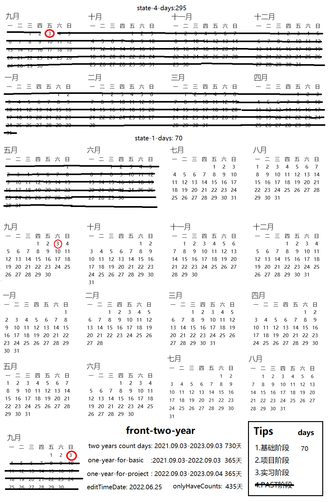

## To Start

> 学生时代马上结束，社畜生活即将到来. 在这段缓冲时间里，对未来的生活做出四年起步计划，不至于对未来如此迷茫. 即没有更好的方向选择、没有更值得做的事，就以此方向进行

## 核心

|    健康    |    工作    |    生活    |    创造    |
| :--------: | :--------: | :--------: | :--------: |
|  身体健康  |  前端编程  |  基本生存  |  利益创造  |
|  生理健康  |  毕业需求  |  丰富生活  |  意义创造  |
| 待完善.... | 待完善.... | 待完善.... | 待完善.... |
| 待完善.... | 待完善.... | 待完善.... | 待完善.... |

- 健康：所谓身体是革命的本钱，是一切生命活动的基础
- 工作：不止是为了获取生存物质基础，也是人的精神需求
- 生活：每一天都是生活，丰富自己的生活才能活的更爽捏
- 创造：普通人和高手的不同在于创造，是一种更高层次的追求

以上是我对普通人所有活动归纳总结的四个点，几乎能概况人生所有活动. 在四年起步计划中. 我划分了两段时间，分别对其中的侧重点进行起步阶段的学习探索

> 虽然是四点，但是每项都是有相互的联系

## front-two-year

**`v1.0.0`** : 2022/04/30 第一版本框架、总体完成，待补充完善

## aim

### 总体目标

- 健康(身体健康、心理健康)
- 工作(前端工程、毕业需求)

四年起步计划中，两年升本时间为第一时间段，侧重点为以上两个方面

🔲 毕业前能完成一次超过`4公里`的跑步，保持经常性的运动习惯

🔲 和大部分人和谐友善相处，意识训练控制七宗罪对自身的堕落

🔲 实习能找一份专业相关的工作，目前方向决定为前端编程方向

🔲 学习专业基础知识、完成毕业设计，最好拿到学位证各证毕业

### 阶段目标

1. ~~past time~~ (09月15日-04月30日 共228天)

   ☑️时间已经浪费啦

2. 基础学习 (05月-08月 共123天)

   🔲背完四级单词、跟几个完整课程，考四级考试

   🔲学习黑马前端培训课程，整体学完准备下一阶段

   🔲待补充....

3. 项目学习(09月-12月 共122天)

4. 实习阶段(01月-07月 实习至毕业)

## Time

### 阶段时间

 ### 每日时间

遵循  `4-8-12`  原则，但是是弹性时间的没有强制要求

`4`  - 基本生存时间

|  start  |   end   | disc |
| :-----: | :-----: | :--: |
| `07:00` | `08:00` | 早餐 |
| `12:00` | `13:00` | 中餐 |
| `18:00` | `19:00` | 晚餐 |
| `21:00` | `22:00` | 洗漱 |

`8` - 另一个世界

|  start  |   end   | disc |
| :-----: | :-----: | :--: |
| `00:00` | `07:00` | main |
| `13:00` | `14:00` | aux  |

`12` - 可分配时间

|  start  |   end   | disc |
| :-----: | :-----: | :--: |
| `08:00` | `12:00` | main |
| `14:00` | `18:00` | main |
| `19:00` | `21:00` | main |
| `22:00` | `12:00` | main |

## task

> 清单任务，是此项目最基础的部分. 如果此部分完成的情况较差，这整个项目的其它部分都是空谈大话.  时间的积累

- [ ] `0/4` 		    
- [ ] `00/40`                 
- [ ] `000/400`             
- [ ] `0000/4000`         

### 阶段任务

🔲 完成黑马前端 `Vue` 部分，开始黑马前端小程序的学习

🔲 过黑马 `python` 基础部分，爬虫部分入门完成全天候课程

🔲 习惯日常学习

### 每日任务

### 🍂**日常任务：**

**固定任务**

🔲 两篇个人 `Blog` 阅读和两道方向相关性题目

🔲 实践相关练习及知识点笔记扩展和日常锻炼

🔲 提出一些相关性的问题及日常模板完善打卡

🔲 每日 **`x/8H`** 的主线学习和 **`x/4H`** 的副线学习

**当日详情**

🔲 学习 **`Vue`**  部分完成黑马头条 

### 🍃**小结：**

**概况叙述**

一些任务未完成

**提出问题**

1. 如何在资源少的学校学习

## vision

### 回顾以往

> 回顾以往阶段的状态情况

- 健康是最重要的，在健康面前一切事情都是无所谓的

- 要去做的事情不要犹豫，犹豫了短时间就不再想去做

#### 学习方式

|   阶段   | 描述 |
| :------: | :--: |
| 统筹预习 |      |
| 系统学习 |      |
| 实践练习 |      |
| 回顾复习 |      |

#### 作品过程

|   阶段   | 描述 |
| :------: | :--: |
| 复制阶段 |      |
| 修改阶段 |      |
| 模仿阶段 |      |
| 创新阶段 |      |

### 展望未来

> 展望一下未来的状态情况

#### 简历准备

|   item   |        aim         |
| :------: | :----------------: |
| 专业技能 |  前端基础知识掌握  |
| 项目经验 |      啥也不会      |
| 开源运营 |      各种平台      |
| 个人简历 | 学历学位、证书奖项 |

#### 职业方向

|   方向   |                           描述                           |
| :------: | :------------------------------------------------------: |
| 打工方向 | 前端码农、后端码农、运维码农、测试码农、销售、普工、剪辑 |
| 自由职业 |                         运营剪辑                         |
| 创业方向 |                    校门口摆摊算创业吗                    |
| 其它方向 |                           寻宝                           |

## back-two-year

待完善....

